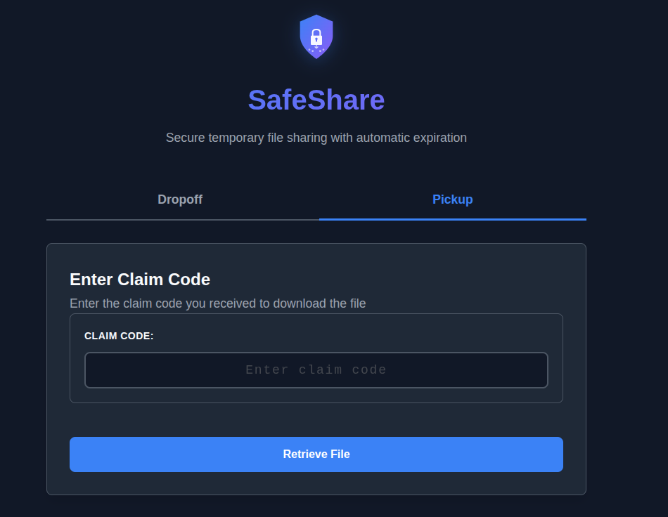
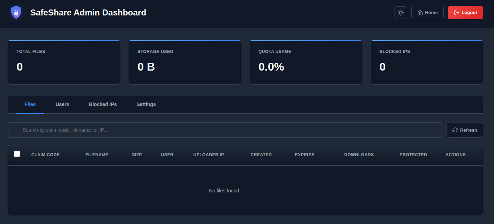
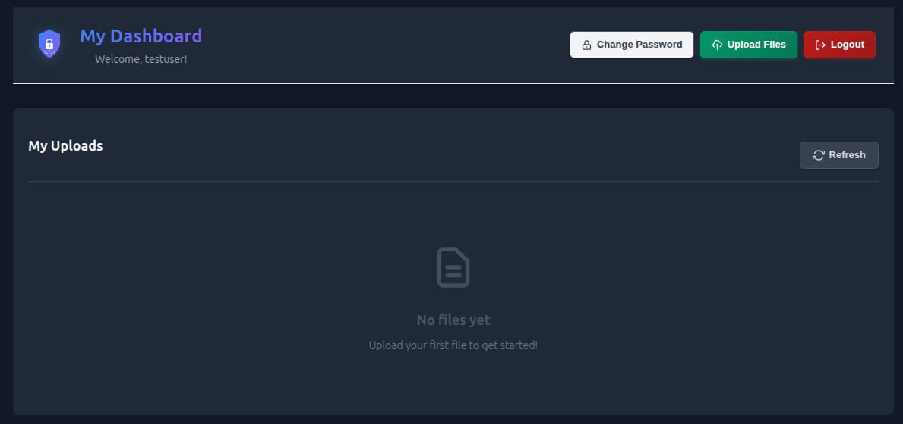
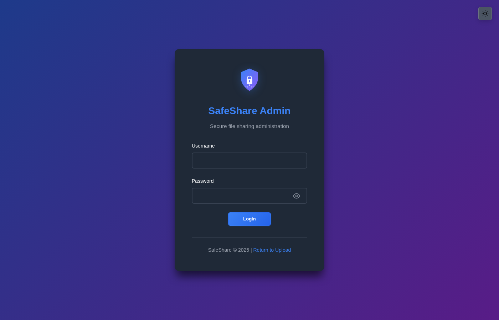

# SafeShare - Secure Temporary File Sharing

A self-hosted secure file sharing service for temporary transfers with automatic expiration and cryptographically secure claim codes.

## Screenshots

### Main Interface

*Modern web interface with drag-drop upload, QR codes, and dark mode support*

### Admin Dashboard

*Comprehensive admin dashboard for file management and user administration*

### User Dashboard

*User dashboard for viewing upload history and managing own files*

### Admin Login (Dark Theme)

*Beautiful dark mode with gradient background for admin authentication*

## Features

### Backend
- ✅ Upload files and receive unique claim codes
- ✅ Download files using claim codes
- ✅ **Chunked/resumable uploads** for large files (>100MB)
- ✅ Automatic file expiration
- ✅ Optional download limits
- ✅ Configurable expiration times
- ✅ RESTful API
- ✅ Single binary deployment
- ✅ Docker container (~26MB)
- ✅ SQLite database (no external dependencies)
- ✅ Database migration system
- ✅ Graceful shutdown
- ✅ Health check endpoint
- ✅ Structured JSON logging

### Enterprise Security 🔒
- ✅ **Password protection** (optional bcrypt-hashed passwords)
- ✅ **Encryption at rest** (AES-256-GCM)
- ✅ **File extension blacklist** (blocks executables)
- ✅ **Enhanced audit logging** (compliance-ready)
- ✅ **Rate limiting** (IP-based DoS protection)
- ✅ **Filename sanitization** (prevents header injection)
- ✅ **Security headers** (CSP, X-Frame-Options, etc.)
- ✅ **MIME type detection** (server-side validation)
- ✅ **Disk space monitoring** (prevents exhaustion)
- ✅ **Maximum expiration limits** (prevents abuse)
- ✅ **Storage quota limits** (configurable per-app limits)

### User Authentication 👤
- ✅ **Invite-only user registration** (admin-managed accounts)
- ✅ **Session-based authentication** (secure httpOnly cookies)
- ✅ **User dashboard** (view upload history, delete own files)
- ✅ **Temporary passwords** (forced password change on first login)
- ✅ **Authenticated uploads** (track files by user)
- ✅ **Anonymous uploads** (configurable - enabled by default, can require authentication)
- ✅ **Public downloads** (no authentication required for claim codes)
- ✅ **User roles** (user/admin role management)

### Admin Dashboard 🎛️
- ✅ **Web-based administration** (secure login with session management)
- ✅ **File management** (view all files, search, paginate, delete)
- ✅ **User management** (create, edit, enable/disable, reset passwords)
- ✅ **IP blocking** (block/unblock IPs from uploads/downloads)
- ✅ **Quota management** (adjust storage limits without restart)
- ✅ **Real-time statistics** (storage usage, file counts, blocked IPs)
- ✅ **CSRF protection** (secure state-changing operations)
- ✅ **Rate-limited login** (prevents brute force attacks)
- ✅ **Audit logging** (all admin actions logged)

### Frontend (Web UI)
- ✅ Modern, responsive web interface (mobile, tablet, desktop)
- ✅ Drag & drop file upload with live validation
- ✅ QR code generation for mobile sharing
- ✅ Dark/Light mode toggle (persistent across all pages)
- ✅ One-click copy to clipboard (HTTP/HTTPS compatible with fallback)
- ✅ Real-time upload progress with percentage display
- ✅ Compact, responsive layouts with intelligent button wrapping
- ✅ Enhanced date formatting (space-saving compact display)
- ✅ Embedded in binary (no separate deployment, ~27KB total)

## Quick Start

### Web UI

Simply visit the root URL after starting the server:

```
http://localhost:8080/              # Main upload interface
http://localhost:8080/admin/login   # Admin dashboard login (if configured)
```

Features drag-drop upload, QR code generation, and one-click sharing!

### Docker

```bash
# Run with default settings (no admin dashboard)
docker run -d \
  -p 8080:8080 \
  -v safeshare-data:/app/data \
  -v safeshare-uploads:/app/uploads \
  --name safeshare \
  fjmerc/safeshare:latest

# Run with admin dashboard enabled
docker run -d \
  -p 8080:8080 \
  -e ADMIN_USERNAME=admin \
  -e ADMIN_PASSWORD="YourSecurePassword123!" \
  -v safeshare-data:/app/data \
  -v safeshare-uploads:/app/uploads \
  --name safeshare \
  fjmerc/safeshare:latest
# Then visit: http://localhost:8080/admin/login

# Run with custom configuration
docker run -d \
  -p 8080:8080 \
  -e MAX_FILE_SIZE=209715200 \
  -e DEFAULT_EXPIRATION_HOURS=48 \
  -e TZ=Europe/Berlin \
  -v safeshare-data:/app/data \
  -v safeshare-uploads:/app/uploads \
  --name safeshare \
  fjmerc/safeshare:latest
```

### Binary

```bash
# Set environment variables (optional)
export PORT=8080
export MAX_FILE_SIZE=104857600
export DEFAULT_EXPIRATION_HOURS=24

# Run the binary
./safeshare
```

## API Documentation

### User Authentication Endpoints

#### User Login
**Endpoint:** `POST /api/auth/login`

**Request:**
```bash
curl -X POST \
  -H "Content-Type: application/json" \
  -d '{"username":"user","password":"password"}' \
  -c cookies.txt \
  http://localhost:8080/api/auth/login
```

**Response (200 OK):**
```json
{
  "id": 1,
  "username": "user",
  "email": "user@example.com",
  "role": "user",
  "require_password_change": false
}
```

#### User Logout
**Endpoint:** `POST /api/auth/logout`

**Request:**
```bash
curl -X POST -b cookies.txt http://localhost:8080/api/auth/logout
```

#### Get Current User
**Endpoint:** `GET /api/auth/user`

**Request:**
```bash
curl -b cookies.txt http://localhost:8080/api/auth/user
```

#### Change Password
**Endpoint:** `POST /api/auth/change-password`

**Request:**
```bash
curl -X POST \
  -H "Content-Type: application/json" \
  -d '{"current_password":"old","new_password":"new","confirm_password":"new"}' \
  -b cookies.txt \
  http://localhost:8080/api/auth/change-password
```

#### User Dashboard - Get Files
**Endpoint:** `GET /api/user/files`

**Request:**
```bash
curl -b cookies.txt http://localhost:8080/api/user/files?limit=50&offset=0
```

**Response (200 OK):**
```json
{
  "files": [
    {
      "claim_code": "Xy9kLm8pQz4vDwE",
      "original_filename": "document.pdf",
      "file_size": 1048576,
      "created_at": "2025-11-05T10:00:00Z",
      "expires_at": "2025-11-06T10:00:00Z",
      "download_count": 2,
      "max_downloads": 5
    }
  ],
  "total": 1,
  "limit": 50,
  "offset": 0
}
```

#### User Dashboard - Delete File
**Endpoint:** `DELETE /api/user/files/delete`

**Request:**
```bash
curl -X DELETE \
  -H "Content-Type: application/json" \
  -d '{"file_id":1}' \
  -b cookies.txt \
  http://localhost:8080/api/user/files/delete
```

### File Sharing Endpoints

### Upload File

Upload a file and receive a unique claim code for sharing.

**Endpoint:** `POST /api/upload`

**Request:**
```bash
curl -X POST \
  -F "file=@document.pdf" \
  -F "expires_in_hours=48" \
  -F "max_downloads=5" \
  -F "password=secret123" \
  http://localhost:8080/api/upload
```

**Parameters:**
- `file` (required): The file to upload
- `expires_in_hours` (optional): Hours until expiration (default: 24)
- `max_downloads` (optional): Maximum number of downloads (default: unlimited)
- `password` (optional): Password required to download the file (bcrypt-hashed)

**Response (201 Created):**
```json
{
  "claim_code": "Xy9kLm8pQz4vDwE",
  "expires_at": "2025-11-06T14:30:00Z",
  "download_url": "http://localhost:8080/api/claim/Xy9kLm8pQz4vDwE",
  "max_downloads": 5,
  "file_size": 1048576,
  "original_filename": "document.pdf"
}
```

**Error Responses:**
- `400 Bad Request`: No file provided or invalid parameters
- `413 Payload Too Large`: File exceeds maximum size
- `500 Internal Server Error`: Server error

### Download File

Download a file using its claim code.

**Endpoint:** `GET /api/claim/:code`

**Request:**
```bash
# Without password
curl -O http://localhost:8080/api/claim/Xy9kLm8pQz4vDwE

# With password (if required)
curl -O "http://localhost:8080/api/claim/Xy9kLm8pQz4vDwE?password=secret123"
```

**Query Parameters:**
- `password` (optional): Password if file is password-protected

**Response (200 OK):**
- File binary data with appropriate headers
- `Content-Type`: Original file MIME type
- `Content-Disposition`: Includes original filename
- `Content-Length`: File size

**Error Responses:**
- `401 Unauthorized`: Incorrect password
- `404 Not Found`: Claim code doesn't exist or file expired
- `410 Gone`: Download limit reached
- `500 Internal Server Error`: Server error

### Health Check

Check service health and statistics.

**Endpoint:** `GET /health`

**Request:**
```bash
curl http://localhost:8080/health
```

**Response (200 OK):**
```json
{
  "status": "healthy",
  "uptime_seconds": 3600,
  "total_files": 42,
  "storage_used_bytes": 104857600,
  "disk_total_bytes": 1000000000000,
  "disk_free_bytes": 500000000000,
  "disk_available_bytes": 500000000000,
  "disk_used_percent": 50.0
}
```

### Chunked Upload Endpoints

For large files (>100MB by default), SafeShare supports chunked/resumable uploads. The frontend automatically uses chunked upload mode when file size exceeds the threshold.

**Full documentation:** See [docs/CHUNKED_UPLOAD.md](docs/CHUNKED_UPLOAD.md) for complete API specifications, curl examples, and architecture details.

#### Initialize Chunked Upload

**Endpoint:** `POST /api/upload/init`

**Request:**
```bash
curl -X POST \
  -H "Content-Type: application/json" \
  -d '{
    "filename": "large-file.zip",
    "total_size": 262144000,
    "chunk_size": 5242880,
    "expires_in_hours": 24,
    "max_downloads": 5
  }' \
  http://localhost:8080/api/upload/init
```

**Response (200 OK):**
```json
{
  "upload_id": "550e8400-e29b-41d4-a716-446655440000",
  "chunk_size": 5242880,
  "total_chunks": 50,
  "expires_at": "2025-11-07T12:00:00Z"
}
```

#### Upload Chunk

**Endpoint:** `POST /api/upload/chunk/:upload_id/:chunk_number`

**Request:**
```bash
curl -X POST \
  -F "chunk=@chunk_0.dat" \
  http://localhost:8080/api/upload/chunk/550e8400-e29b-41d4-a716-446655440000/0
```

**Response (200 OK):**
```json
{
  "upload_id": "550e8400-...",
  "chunk_number": 0,
  "chunks_received": 1,
  "total_chunks": 50,
  "complete": false
}
```

#### Complete Upload

**Endpoint:** `POST /api/upload/complete/:upload_id`

**Request:**
```bash
curl -X POST http://localhost:8080/api/upload/complete/550e8400-e29b-41d4-a716-446655440000
```

**Response (200 OK):**
```json
{
  "claim_code": "aFYR83-afRPqrb-8",
  "download_url": "http://localhost:8080/api/claim/aFYR83-afRPqrb-8"
}
```

#### Check Upload Status

**Endpoint:** `GET /api/upload/status/:upload_id`

**Request:**
```bash
curl http://localhost:8080/api/upload/status/550e8400-e29b-41d4-a716-446655440000
```

**Response (200 OK):**
```json
{
  "upload_id": "550e8400-...",
  "filename": "large-file.zip",
  "chunks_received": 25,
  "total_chunks": 50,
  "missing_chunks": [0, 15, 27],
  "complete": false,
  "expires_at": "2025-11-07T12:00:00Z"
}
```

## Configuration

Environment variables:

| Variable | Default | Description |
|----------|---------|-------------|
| `PORT` | `8080` | HTTP server port |
| `DB_PATH` | `./safeshare.db` | SQLite database path |
| `UPLOAD_DIR` | `./uploads` | File storage directory |
| `MAX_FILE_SIZE` | `104857600` | Max file size in bytes (100MB) |
| `DEFAULT_EXPIRATION_HOURS` | `24` | Default expiration time in hours |
| `CLEANUP_INTERVAL_MINUTES` | `60` | Cleanup job frequency in minutes |
| `PUBLIC_URL` | (empty) | Public URL for download links (e.g., `https://share.domain.com`) - **Required for reverse proxies** |
| `DOWNLOAD_URL` | (empty) | Optional separate URL for download links to bypass CDN timeouts (e.g., `https://downloads.domain.com`) - **Takes priority over PUBLIC_URL if set** |
| `ENCRYPTION_KEY` | (empty) | AES-256 encryption key (64 hex chars) - **Optional, enables encryption at rest** |
| `HTTPS_ENABLED` | `false` | Enable HTTPS mode (affects auto-detection of scheme in reverse proxy scenarios) |
| `BLOCKED_EXTENSIONS` | `.exe,.bat,...` | Comma-separated list of blocked file extensions |
| `MAX_EXPIRATION_HOURS` | `168` | Maximum allowed expiration time in hours (default: 7 days) |
| `RATE_LIMIT_UPLOAD` | `10` | Maximum upload requests per hour per IP |
| `RATE_LIMIT_DOWNLOAD` | `50` | Maximum download requests per hour per IP |
| `QUOTA_LIMIT_GB` | `0` | Maximum total storage quota in GB (0 = unlimited) |
| `CHUNKED_UPLOAD_ENABLED` | `true` | Enable/disable chunked upload support |
| `CHUNKED_UPLOAD_THRESHOLD` | `104857600` | Files >= this size use chunked upload (default: 100MB) |
| `CHUNK_SIZE` | `10485760` | Size of each chunk in bytes (default: 10MB) |
| `PARTIAL_UPLOAD_EXPIRY_HOURS` | `24` | Hours before abandoned uploads are cleaned up |
| `READ_TIMEOUT` | `120` | HTTP read timeout in seconds (default: 2 minutes) |
| `WRITE_TIMEOUT` | `120` | HTTP write timeout in seconds (default: 2 minutes) |
| `REQUIRE_AUTH_FOR_UPLOAD` | `false` | Require user authentication for uploads - **Set to `true` for invite-only mode** |
| `ADMIN_USERNAME` | (empty) | Admin username for dashboard access - **Optional, enables admin dashboard** |
| `ADMIN_PASSWORD` | (empty) | Admin password (minimum 8 characters) - **Optional, requires ADMIN_USERNAME** |
| `SESSION_EXPIRY_HOURS` | `24` | Admin session expiration time in hours |
| `TZ` | `UTC` | Timezone for container (logs always use UTC per industry standard) |

### Admin Dashboard

The admin dashboard provides web-based administration for SafeShare. Enable it by setting both `ADMIN_USERNAME` and `ADMIN_PASSWORD`:

```bash
docker run -d \
  -e ADMIN_USERNAME=admin \
  -e ADMIN_PASSWORD=your_secure_password_here \
  -p 8080:8080 \
  safeshare:latest
```

**Access the dashboard:**
- Login: `http://localhost:8080/admin/login`
- Dashboard: `http://localhost:8080/admin/dashboard` (requires authentication)

**Features:**
- **Files tab**: View all uploaded files, search by claim code/filename/IP, delete files before expiration
- **Users tab**: Create user accounts, edit profiles, enable/disable users, reset passwords, delete users
- **Blocked IPs tab**: Block/unblock IP addresses from uploading or downloading files
- **Settings tab**: Adjust storage quota, change admin password without restarting the application
- **Real-time stats**: Monitor total files, storage usage, quota usage, blocked IPs, and user accounts
- **Security**: Session-based authentication, CSRF protection, rate-limited login (5 attempts per 15 minutes)
- **Audit logging**: All admin actions are logged with IP and timestamp

**User Management:**
- **Create users**: Admin-only user creation with temporary passwords
- **Invite-only model**: No public registration - all accounts created by admins
- **Role assignment**: Assign user or admin roles during account creation
- **Password management**: Force password change on first login, reset passwords when needed
- **Account control**: Enable/disable users without deleting their data

### Reverse Proxy Support

SafeShare works seamlessly behind reverse proxies (Traefik, nginx, Caddy, Apache).

**Quick setup:**
```bash
docker run -d \
  -e PUBLIC_URL=https://share.yourdomain.com \
  -p 8080:8080 \
  safeshare:latest
```

**Auto-detection:** If `PUBLIC_URL` is not set, SafeShare auto-detects from `X-Forwarded-Proto` and `X-Forwarded-Host` headers.

**CDN Bypass for Large Files:** If using Cloudflare or similar CDN with timeout limits, set `DOWNLOAD_URL` to a separate DNS-only subdomain to bypass the CDN for downloads while keeping uploads and UI protected.

**Full documentation:** See [REVERSE_PROXY.md](docs/REVERSE_PROXY.md) for complete configuration examples with Traefik, nginx, Caddy, and Apache.

## Building from Source

### Prerequisites

- Go 1.21 or later
- Docker (for containerized builds)

### Build Binary

```bash
# Clone repository
git clone https://github.com/fjmerc/safeshare
cd safeshare

# Build (requires Go installed locally)
go build -o safeshare ./cmd/safeshare

# Run
./safeshare
```

### Build Docker Image

```bash
# Build image
docker build -t safeshare:latest .

# Check image size
docker images safeshare

# Run container
docker run -d -p 8080:8080 --name safeshare safeshare:latest
```

## Architecture

```
SafeShare Application
├── HTTP Server (net/http)
│   ├── Public Handlers
│   │   ├── Upload Handler (authenticated or anonymous)
│   │   ├── Chunked Upload Handlers (init, chunk, complete, status)
│   │   ├── Claim Handler (download files)
│   │   └── Health Handler
│   ├── User Authentication
│   │   ├── Login/Logout Handlers
│   │   ├── Password Change Handler
│   │   ├── User Dashboard Handlers
│   │   └── Session Middleware
│   └── Admin Dashboard
│       ├── Admin Login Handler
│       ├── User Management Handlers
│       ├── File Management Handlers
│       ├── IP Blocking Handlers
│       └── Settings Handlers
├── SQLite Database (modernc.org/sqlite)
│   ├── files table (with user_id foreign key)
│   ├── partial_uploads table (chunked upload sessions)
│   ├── migrations table (schema versioning)
│   ├── users table (authentication)
│   ├── user_sessions table
│   ├── admin_credentials table
│   ├── admin_sessions table
│   └── blocked_ips table
├── File Storage
│   ├── Completed files: UUID-based filenames (encrypted if ENCRYPTION_KEY set)
│   └── Partial uploads: .partial/{upload_id}/chunk_{number}
├── Middleware
│   ├── User Authentication (optional or required)
│   ├── Admin Authentication
│   ├── Rate Limiting
│   ├── IP Blocking
│   ├── CSRF Protection
│   └── Security Headers
└── Background Workers
    ├── Expired File Cleanup
    ├── Partial Upload Cleanup (abandoned uploads)
    └── Expired Session Cleanup
```

### Security Features

#### Data Protection
- **Encryption at rest**: AES-256-GCM encryption for stored files (optional)
- **MIME type detection**: Server-side validation prevents malware masquerading
- **File extension blacklist**: Blocks dangerous file types (executables, scripts)
- **Automatic expiration**: Files automatically deleted after expiration
- **Maximum expiration limits**: Prevents disk abuse (default: 7 days max)

#### Attack Prevention
- **Rate limiting**: IP-based protection against DoS attacks (10 uploads/hour, 50 downloads/hour)
- **Storage quota limits**: Configurable per-application storage limits prevent disk abuse
- **Filename sanitization**: Prevents HTTP header injection and path traversal
- **Security headers**: CSP, X-Frame-Options, X-Content-Type-Options prevent XSS/clickjacking
- **Disk space monitoring**: Pre-upload checks prevent disk exhaustion
- **Input validation**: All user inputs validated and sanitized
- **Parameterized SQL queries**: Prevents SQL injection attacks
- **Timeout enforcement**: HTTP timeouts prevent slowloris attacks

#### Authentication & Authorization
- **User authentication**: Session-based authentication with secure httpOnly cookies
- **Password security**: Bcrypt hashing with cost factor 10 for all passwords
- **Session management**: Separate user and admin sessions with configurable expiry
- **Temporary passwords**: Force password change on first login for new users
- **Role-based access**: User and admin roles with different permissions
- **Invite-only registration**: Admin-managed user accounts prevent unauthorized access

#### Operational Security
- **Enhanced audit logging**: Comprehensive security event logging for compliance
- **Cryptographically secure claim codes**: Uses `crypto/rand` for code generation
- **Cryptographically secure sessions**: Uses `crypto/rand` for session tokens
- **Non-root container user**: Container runs as user ID 1000
- **File size limits**: Enforced at application and HTTP levels

**📖 For detailed security configuration, see [SECURITY.md](docs/SECURITY.md)**

## Example Workflows

### User Login and Dashboard

```bash
# User login (returns user info and sets session cookie)
curl -c user_cookies.txt \
  -H "Content-Type: application/json" \
  -d '{"username":"user","password":"password"}' \
  http://localhost:8080/api/auth/login

# View uploaded files in user dashboard
curl -b user_cookies.txt http://localhost:8080/api/user/files

# Upload file as authenticated user (tracks ownership)
curl -b user_cookies.txt \
  -X POST \
  -F "file=@document.pdf" \
  http://localhost:8080/api/upload

# Delete own file from dashboard
curl -b user_cookies.txt \
  -X DELETE \
  -H "Content-Type: application/json" \
  -d '{"file_id":1}' \
  http://localhost:8080/api/user/files/delete

# Logout
curl -b user_cookies.txt -X POST http://localhost:8080/api/auth/logout
```

**Web UI access:**
- User login: `http://localhost:8080/login`
- User dashboard: `http://localhost:8080/dashboard`
- Homepage shows login status and displays user greeting when logged in

### Basic File Sharing

```bash
# Upload a file
RESPONSE=$(curl -s -X POST -F "file=@report.pdf" http://localhost:8080/api/upload)
echo $RESPONSE | jq .

# Extract claim code
CLAIM_CODE=$(echo $RESPONSE | jq -r '.claim_code')

# Share the claim code with recipient
echo "Share this code: $CLAIM_CODE"

# Recipient downloads the file
curl -O http://localhost:8080/api/claim/$CLAIM_CODE
```

### Temporary One-Time Share

```bash
# Upload with 1-hour expiration and 1 download limit
curl -X POST \
  -F "file=@sensitive-doc.pdf" \
  -F "expires_in_hours=1" \
  -F "max_downloads=1" \
  http://localhost:8080/api/upload | jq .
```

### Quick Share (Minutes)

```bash
# Upload with 30-minute expiration
curl -X POST \
  -F "file=@quick-share.txt" \
  -F "expires_in_hours=0.5" \
  http://localhost:8080/api/upload | jq .
```

## Development

### Project Structure

```
safeshare/
├── cmd/safeshare/          # Application entry point
│   └── main.go
├── internal/
│   ├── config/             # Configuration management
│   ├── database/           # Database operations
│   ├── handlers/           # HTTP request handlers
│   ├── middleware/         # HTTP middleware
│   ├── models/             # Data models
│   └── utils/              # Utility functions
├── go.mod                  # Go module definition
├── go.sum                  # Dependency checksums
├── Dockerfile              # Container build instructions
└── README.md               # This file
```

### Running Tests

```bash
# Create test file
echo "Test content" > test.txt

# Test upload
curl -X POST -F "file=@test.txt" http://localhost:8080/api/upload

# Test health
curl http://localhost:8080/health

# Test error handling
curl -X POST http://localhost:8080/api/upload
curl http://localhost:8080/api/claim/INVALID_CODE
```

## Troubleshooting

### Container won't start

Check logs:
```bash
docker logs safeshare
```

Common issues:
- Port 8080 already in use
- Insufficient permissions for data directories
- Invalid environment variable values

### Database errors

The SQLite database is created automatically. If you encounter issues:
```bash
# Remove and recreate volumes
docker stop safeshare
docker rm safeshare
docker volume rm safeshare-data
docker run -d -p 8080:8080 -v safeshare-data:/app/data -v safeshare-uploads:/app/uploads safeshare:latest
```

### File upload fails

Check:
- File size is within `MAX_FILE_SIZE` limit
- Disk space available for uploads
- Permissions on upload directory

## Performance

- **Startup time**: < 1 second
- **Memory usage**: ~10-20 MB baseline
- **Disk usage**: File size + ~1KB per file record
- **Concurrent requests**: Handles 1000+ concurrent connections
- **SQLite WAL mode**: Improved concurrency for reads/writes

## License

MIT License - See LICENSE file for details

## Contributing

Contributions welcome! Please:
1. Fork the repository
2. Create a feature branch
3. Make your changes
4. Add tests if applicable
5. Submit a pull request

## Documentation

Comprehensive documentation is available in the [`docs/`](docs/) directory:

| Document | Description | Audience |
|----------|-------------|----------|
| **[CLAUDE.md](CLAUDE.md)** | Architecture overview, build commands, development guide | Developers, DevOps |
| **[CHUNKED_UPLOAD.md](docs/CHUNKED_UPLOAD.md)** | Chunked/resumable upload API, architecture, usage examples | Developers, API users |
| **[SECURITY.md](docs/SECURITY.md)** | Enterprise security features, admin dashboard security, best practices | Security teams, Admins |
| **[FRONTEND.md](docs/FRONTEND.md)** | Web UI features, customization guide, admin dashboard UI | Frontend developers |
| **[REVERSE_PROXY.md](docs/REVERSE_PROXY.md)** | Reverse proxy configuration (Traefik, nginx, Caddy, Apache) | DevOps, Sysadmins |

**Quick Links:**
- 🔐 [Admin Dashboard Security](docs/SECURITY.md#admin-dashboard-security)
- 🛡️ [Encryption at Rest](docs/SECURITY.md#encryption-at-rest)
- 🎨 [Frontend Customization](docs/FRONTEND.md#customization)
- 🔧 [Development Guide](CLAUDE.md#build-and-development-commands)

## Support

For issues and questions:
- GitHub Issues: https://github.com/fjmerc/safeshare/issues
- Documentation: See this README and developer docs above

## Changelog

See [CHANGELOG.md](CHANGELOG.md) for complete version history.
