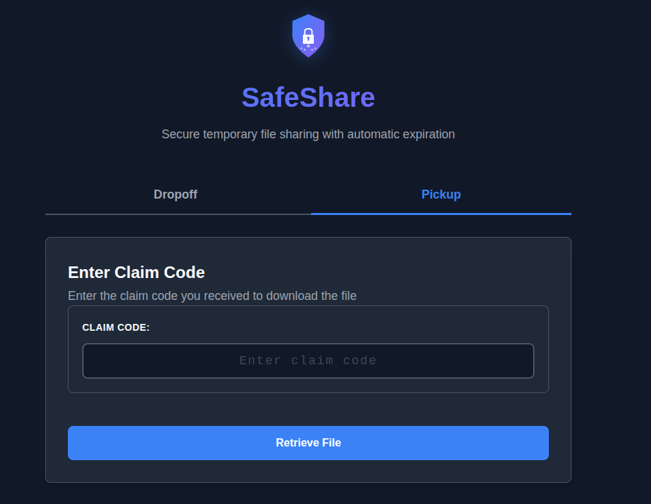
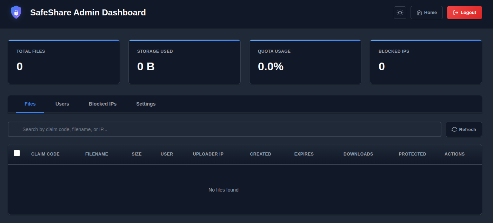

# SafeShare

[](https://github.com/fjmerc/safeshare/actions/workflows/build-and-push.yml)
[](https://goreportcard.com/report/github.com/fjmerc/safeshare)

Self-hosted file sharing that gets out of your way. Upload a file, get a link, share it. Files auto-expire when you want them to. No accounts required.

**Version**: 1.5.4


*Drag-drop upload, QR codes, dark mode, and installable as a PWA*


*Optional admin dashboard for file management and system configuration*

---

## Get Running

### One command

```bash
docker run -d -p 8080:8080 \
  -v safeshare-data:/app/data \
  -v safeshare-uploads:/app/uploads \
  --name safeshare \
  fjmerc/safeshare:latest
```

Visit **http://localhost:8080** and start sharing files.

### With encryption and admin dashboard

```bash
docker run -d -p 8080:8080 \
  -e ENCRYPTION_KEY="$(openssl rand -hex 32)" \
  -e ADMIN_USERNAME=admin \
  -e ADMIN_PASSWORD="YourSecurePassword123!" \
  -v safeshare-data:/app/data \
  -v safeshare-uploads:/app/uploads \
  --name safeshare \
  fjmerc/safeshare:latest
```

This gives you AES-256 encryption at rest and an admin dashboard at `/admin/login`.

### Docker Compose (recommended)

```yaml
# docker-compose.yml
services:
  safeshare:
    image: fjmerc/safeshare:latest
    ports:
      - "8080:8080"
    environment:
      - ENCRYPTION_KEY=${ENCRYPTION_KEY}       # openssl rand -hex 32
      - ADMIN_USERNAME=admin
      - ADMIN_PASSWORD=${ADMIN_PASSWORD}
      - QUOTA_LIMIT_GB=100
      - DEFAULT_EXPIRATION_HOURS=24
      - TZ=America/New_York
    volumes:
      - safeshare-data:/app/data
      - safeshare-uploads:/app/uploads
    restart: unless-stopped

volumes:
  safeshare-data:
  safeshare-uploads:
```

```bash
export ENCRYPTION_KEY=$(openssl rand -hex 32)
export ADMIN_PASSWORD="YourSecurePassword123!"
docker compose up -d
```

### Without Docker

```bash
wget https://github.com/fjmerc/safeshare/releases/latest/download/safeshare-linux-amd64
chmod +x safeshare-linux-amd64
./safeshare-linux-amd64
```

---

## What You Get

- **Drag-and-drop uploads** with automatic expiration and download limits
- **Password-protected files** for sensitive shares
- **QR code generation** for easy mobile sharing
- **End-to-end encryption** in the browser (server never sees your files)
- **Resumable uploads and downloads** for large files
- **AES-256 encryption at rest** for everything stored on disk
- **Metadata stripping** removes EXIF, GPS, and author info from uploads
- **Anonymous mode** redacts all IP addresses from logs and database
- **Tor hidden service support** for maximum anonymity
- **Admin dashboard** for file management, user administration, and system config
- **User accounts** with invite-only registration, MFA, and SSO (optional)
- **API with tokens** for programmatic access and integrations
- **Webhook notifications** for file lifecycle events
- **PostgreSQL and S3** backends for production scale
- **~26MB Docker image**, starts in under a second, runs on ~15MB RAM
- **Installable PWA** with offline support

---

## Deployment Modes

SafeShare can serve very different purposes depending on how you configure it:

```
ANONYMITY                                                              SECURITY
Protect users from the system                    Protect the operator from users

  [GHOST]           [STANDARD]           [HARDENED]           [FORTRESS]
```

| Mode | For | What it means |
|------|-----|---------------|
| **Ghost** | Whistleblowers, journalists, activists | Tor hidden service, no IP logging, E2E encryption, metadata stripping |
| **Standard** | Personal use, small teams | Secure defaults out of the box, minimal config |
| **Hardened** | Enterprises, internal tools | Auth required, MFA, webhooks, full audit logging |
| **Fortress** | Regulated industries (HIPAA, SOC2) | PostgreSQL, SSO, automated backups, compliance-ready |

Each mode comes with a complete docker-compose example and configuration guide. See **[Deployment Modes](docs/DEPLOYMENT_MODES.md)** for details.

---

## Documentation

| Topic | Guide |
|-------|-------|
| Choosing a deployment mode | [DEPLOYMENT_MODES.md](docs/DEPLOYMENT_MODES.md) |
| Production deployment | [PRODUCTION.md](docs/PRODUCTION.md) |
| API reference | [API_REFERENCE.md](docs/API_REFERENCE.md) |
| Security and compliance | [SECURITY.md](docs/SECURITY.md) |
| Reverse proxy setup | [REVERSE_PROXY.md](docs/REVERSE_PROXY.md) |
| SSO / MFA setup | [SSO_SETUP.md](docs/SSO_SETUP.md) / [MFA_SETUP.md](docs/MFA_SETUP.md) |
| Backup and restore | [BACKUP_RESTORE.md](docs/BACKUP_RESTORE.md) |
| Tor hidden service | [TOR_DEPLOYMENT.md](docs/TOR_DEPLOYMENT.md) |
| E2E encryption | [E2E_ENCRYPTION.md](docs/E2E_ENCRYPTION.md) |
| Monitoring (Prometheus) | [PROMETHEUS.md](docs/PROMETHEUS.md) |
| Architecture | [ARCHITECTURE.md](docs/ARCHITECTURE.md) |
| Troubleshooting | [TROUBLESHOOTING.md](docs/TROUBLESHOOTING.md) |
| All documentation | [docs/](docs/README.md) |

---

## Contributing

Contributions welcome. See [CONTRIBUTING.md](docs/CONTRIBUTING.md) for guidelines and [VERSION_STRATEGY.md](docs/VERSION_STRATEGY.md) for the branching strategy. PRs go to the `develop` branch.

## License

MIT License - See [LICENSE](LICENSE) for details.

## Support

- [GitHub Issues](https://github.com/fjmerc/safeshare/issues) - Bugs and feature requests
- [Security Issues](docs/SECURITY.md) - Responsible disclosure
- [Changelog](docs/CHANGELOG.md) - Version history
