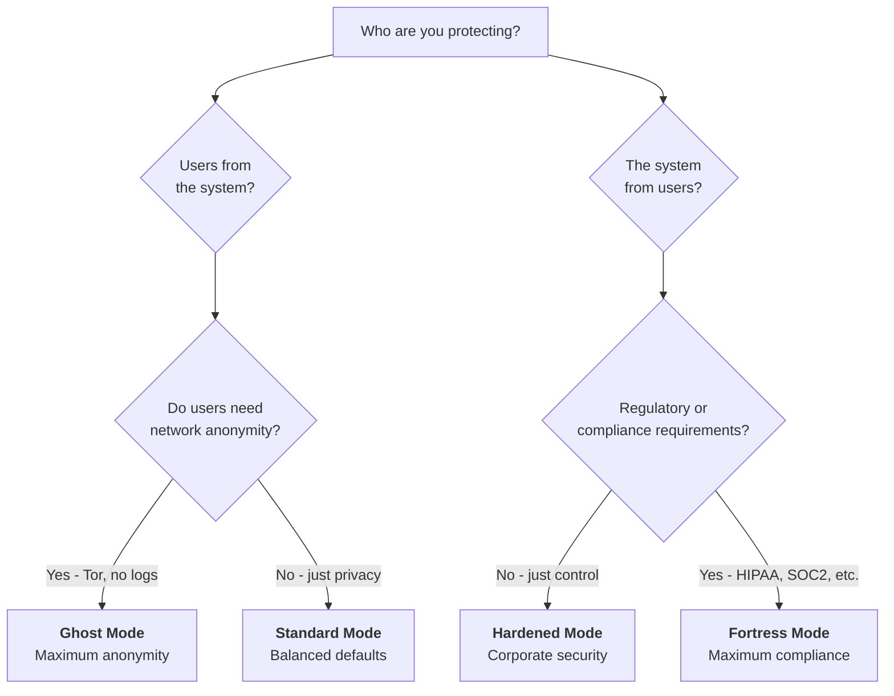

# Deployment Modes

SafeShare serves two fundamentally different missions depending on how you deploy it. Understanding this duality is the most important decision you'll make before configuring a single environment variable.

## The Duality

Every file-sharing platform sits somewhere on a spectrum between two opposing goals:

```
ANONYMITY                                                              SECURITY
Protect users from the system                    Protect the operator from users
"I can't hand over what I don't have"         "I need to control what flows through"

  [GHOST]           [STANDARD]           [HARDENED]           [FORTRESS]
```

**Anonymity mode** shields users. The operator minimizes what they know, what they log, and what they can be compelled to produce. Use cases: whistleblowing, journalism, activism, human rights.

**Security mode** shields the operator. The operator maximizes visibility, accountability, and control over what flows through their system. Use cases: corporate file transfer, regulated industries, compliance.

Both are legitimate. Both serve real needs. SafeShare is designed to serve either end — and anywhere in between — through configuration alone.

## Choosing Your Mode



### Quick Comparison

| Dimension | Ghost | Standard | Hardened | Fortress |
|-----------|-------|----------|----------|----------|
| **Trust model** | Operator trusts no one (including themselves) | Moderate trust | Operator controls access | Zero trust, full audit |
| **User authentication** | None | Optional | Required | Required + MFA + SSO |
| **IP logging** | Redacted everywhere | Logged | Logged | Logged + tamper-evident |
| **File content visibility** | Zero (E2E encrypted) | Server-side encrypted | Server-side encrypted | Server-side encrypted |
| **Metadata stripping** | Always on | Off by default | Off by default | Off by default |
| **Network access** | Tor only | Clearnet | Clearnet + proxy | Clearnet + proxy |
| **Abuse prevention** | Minimal | Basic rate limits | Full controls | Full controls + audit |
| **Audit trail** | None (by design) | Basic logs | Structured JSON logs | Full audit + backups |
| **Database** | SQLite | SQLite | SQLite or PostgreSQL | PostgreSQL |
| **Best for** | Whistleblowers, journalists | Personal use, small teams | Enterprises, internal tools | Regulated industries |

---

## Ghost Mode

**Maximum Anonymity** — the operator can't identify users, can't read files, and can't produce records if compelled.

### Who it's for

Whistleblower drops, journalist source protection, human rights organizations, activist networks, and any scenario where the operator's inability to cooperate with surveillance is a feature.

### Trust model

The operator deliberately minimizes their own capabilities:
- **Cannot** identify who uploaded a file (IPs redacted from database and logs)
- **Cannot** read file contents (client-side E2E encryption, key never touches server)
- **Cannot** recover metadata from uploads (EXIF, GPS, author info stripped)
- **Cannot** be reached via network analysis (Tor hidden service, no clearnet exposure)

### Configuration

```yaml
# docker-compose.ghost.yml
services:
  safeshare:
    image: fjmerc/safeshare:latest
    environment:
      # --- Anonymity ---
      - ANONYMOUS_MODE=true
      - STRIP_METADATA=true
      - REQUIRE_AUTH_FOR_UPLOAD=false
      # --- Encryption ---
      - ENCRYPTION_KEY=${ENCRYPTION_KEY}
      # --- Network ---
      - TRUST_PROXY_HEADERS=false
      - PUBLIC_URL=http://${ONION_ADDRESS}
      - READ_TIMEOUT=300
      - WRITE_TIMEOUT=300
      # --- Short-lived files ---
      - DEFAULT_EXPIRATION_HOURS=1
      - MAX_EXPIRATION_HOURS=24
      - CLEANUP_INTERVAL_MINUTES=15
      # --- Admin (still needed for management) ---
      - ADMIN_USERNAME=${ADMIN_USERNAME}
      - ADMIN_PASSWORD=${ADMIN_PASSWORD}
    volumes:
      - safeshare-data:/app/data
      - safeshare-uploads:/app/uploads
    # No port exposure — only accessible via Tor
    networks:
      - tor-net

  tor:
    image: goldy/tor-hidden-service
    environment:
      SERVICE1_TOR_SERVICE_HOSTS: "80:safeshare:8080"
      SERVICE1_TOR_SERVICE_VERSION: "3"
    volumes:
      - tor-keys:/var/lib/tor/hidden_service
    networks:
      - tor-net

volumes:
  safeshare-data:
  safeshare-uploads:
  tor-keys:

networks:
  tor-net:
    driver: bridge
```

### Trade-offs

- No abuse prevention — the operator cannot inspect or moderate content
- No user accountability — anonymous uploads mean no way to trace bad actors
- No content scanning — E2E encryption makes server-side scanning impossible
- Tor adds latency (200-500ms per hop) and limits throughput (1-5 MB/s)

### Deep dives

- [TOR_DEPLOYMENT.md](TOR_DEPLOYMENT.md) — Complete Tor hidden service setup, verification, and threat model
- [E2E_ENCRYPTION.md](E2E_ENCRYPTION.md) — Client-side encryption technical details and limitations

---

## Standard Mode

**Balanced Defaults** — secure file sharing with sensible defaults and minimal configuration.

### Who it's for

Personal file sharing, small teams, developers, anyone who wants a self-hosted alternative to WeTransfer or Firefox Send without complex setup.

### Trust model

The operator runs a straightforward service:
- Basic server-side encryption at rest (if `ENCRYPTION_KEY` is set)
- IPs are logged (for rate limiting and abuse response)
- Anonymous uploads allowed by default
- Files auto-expire (24 hours default)

### Configuration

```bash
# Standard mode — one command
docker run -d \
  -p 8080:8080 \
  -e ENCRYPTION_KEY="$(openssl rand -hex 32)" \
  -e ADMIN_USERNAME=admin \
  -e ADMIN_PASSWORD="$(openssl rand -base64 16)" \
  -v safeshare-data:/app/data \
  -v safeshare-uploads:/app/uploads \
  --name safeshare \
  fjmerc/safeshare:latest
```

This gives you:
- AES-256-GCM encryption at rest
- Admin dashboard at `/admin/login`
- Anonymous uploads with 24-hour expiration
- Rate limiting (10 uploads/hour, 50 downloads/hour per IP)
- File extension blocking (executables, scripts)
- Security headers and CSRF protection

### Recommended additions

| Addition | Why | How |
|----------|-----|-----|
| HTTPS via reverse proxy | Enables E2E encryption in browsers | See [REVERSE_PROXY.md](REVERSE_PROXY.md) |
| Storage quota | Prevents disk abuse | `-e QUOTA_LIMIT_GB=50` |
| Monitoring | Visibility into usage | See [PROMETHEUS.md](PROMETHEUS.md) |

### Deep dives

- [PRODUCTION.md](PRODUCTION.md) — Full production deployment runbook
- [REVERSE_PROXY.md](REVERSE_PROXY.md) — Traefik, nginx, Caddy, Apache configurations

---

## Hardened Mode

**Corporate Security** — the operator requires authentication, visibility, and control over all file sharing activity.

### Who it's for

Enterprises sharing files internally or with partners, teams handling sensitive (but not regulated) data, organizations that need audit trails and access control.

### Trust model

The operator enforces accountability:
- **All users must authenticate** before uploading
- **MFA required** for admin access, available for all users
- **Webhooks** notify external systems of file events
- **IP blocking** stops known bad actors
- **Full audit logging** in structured JSON for SIEM integration

### Configuration

```yaml
# docker-compose.hardened.yml
services:
  safeshare:
    image: fjmerc/safeshare:latest
    environment:
      # --- Authentication ---
      - REQUIRE_AUTH_FOR_UPLOAD=true
      - ADMIN_USERNAME=${ADMIN_USERNAME}
      - ADMIN_PASSWORD=${ADMIN_PASSWORD}
      - SESSION_EXPIRY_HOURS=8
      # --- Encryption ---
      - ENCRYPTION_KEY=${ENCRYPTION_KEY}
      - HTTPS_ENABLED=true
      # --- MFA ---
      - FEATURE_MFA=true
      - MFA_ENABLED=true
      # --- Integrations ---
      - FEATURE_WEBHOOKS=true
      - FEATURE_API_TOKENS=true
      # --- Malware scanning ---
      - FEATURE_MALWARE_SCAN=true
      - CLAMAV_HOST=clamav
      - CLAMAV_PORT=3310
      - CLAMAV_TIMEOUT=30
      - CLAMAV_MAX_FILE_SIZE=104857600
      # --- Access control ---
      - BLOCKED_EXTENSIONS=.exe,.bat,.cmd,.sh,.ps1,.dll,.so,.msi,.scr,.vbs,.jar,.com,.app,.deb,.rpm
      - RATE_LIMIT_UPLOAD=10
      - RATE_LIMIT_DOWNLOAD=50
      - QUOTA_LIMIT_GB=100
      - MAX_FILE_SIZE=5368709120
      # --- Proxy ---
      - TRUST_PROXY_HEADERS=auto
      - PUBLIC_URL=https://share.yourcompany.com
    volumes:
      - safeshare-data:/app/data
      - safeshare-uploads:/app/uploads
    ports:
      - "8080:8080"
    depends_on:
      clamav:
        condition: service_started

  clamav:
    image: clamav/clamav:latest
    volumes:
      - clam-db:/var/lib/clamav
    restart: unless-stopped

volumes:
  safeshare-data:
  safeshare-uploads:
  clam-db:
```

### What this enables

- **User management**: Invite-only registration, role-based access (user/admin)
- **MFA**: TOTP authenticator apps for all users
- **Malware scanning**: Uploaded files scanned asynchronously via ClamAV sidecar; infected files quarantined automatically
- **Webhook notifications**: Real-time alerts on `file.uploaded`, `file.downloaded`, `file.expired`, `file.deleted`, `file.infected`
- **API tokens**: Programmatic access with scoped permissions and rotation
- **Audit logs**: Every upload, download, login, and admin action logged in structured JSON

### Trade-offs

- Users must create accounts and authenticate — higher friction
- Anonymous sharing is no longer possible
- Requires ongoing user administration (invites, password resets, etc.)

### Deep dives

- [SECURITY.md](SECURITY.md) — Full security feature documentation and compliance mapping
- [MFA_SETUP.md](MFA_SETUP.md) — MFA configuration with authenticator apps and WebAuthn
- [SSO_SETUP.md](SSO_SETUP.md) — Enterprise SSO with OIDC providers

---

## Fortress Mode

**Maximum Compliance** — every action is logged, verified, and auditable. Built for regulated environments.

### Who it's for

Financial services, healthcare (HIPAA), government agencies, defense contractors, and any organization where regulatory compliance is non-negotiable.

### Trust model

Zero trust with full audit:
- **All authentication paths hardened** (MFA required, SSO enforced, short sessions)
- **Production-grade database** (PostgreSQL for durability, replication, and audit)
- **Automated backups** with retention policies
- **Every action auditable** through structured logs and database records

### Configuration

```yaml
# docker-compose.fortress.yml
services:
  safeshare:
    image: fjmerc/safeshare:latest
    environment:
      # --- Authentication ---
      - REQUIRE_AUTH_FOR_UPLOAD=true
      - ADMIN_USERNAME=${ADMIN_USERNAME}
      - ADMIN_PASSWORD=${ADMIN_PASSWORD}
      - SESSION_EXPIRY_HOURS=4
      # --- Encryption ---
      - ENCRYPTION_KEY=${ENCRYPTION_KEY}
      - HTTPS_ENABLED=true
      # --- MFA (mandatory) ---
      - FEATURE_MFA=true
      - MFA_ENABLED=true
      - MFA_REQUIRED=true
      # --- SSO ---
      - FEATURE_SSO=true
      - ENABLE_SSO=true
      - SSO_AUTO_PROVISION=true
      - SSO_DEFAULT_ROLE=user
      - SSO_SESSION_LIFETIME=480
      # --- Integrations ---
      - FEATURE_WEBHOOKS=true
      - FEATURE_API_TOKENS=true
      # --- Malware scanning ---
      - FEATURE_MALWARE_SCAN=true
      - CLAMAV_HOST=clamav
      - CLAMAV_PORT=3310
      - CLAMAV_TIMEOUT=30
      - CLAMAV_MAX_FILE_SIZE=104857600
      # --- PostgreSQL ---
      - DATABASE_TYPE=postgresql
      - FEATURE_POSTGRESQL=true
      - PG_HOST=postgres
      - PG_PORT=5432
      - PG_USER=${PG_USER}
      - PG_PASSWORD=${PG_PASSWORD}
      - PG_DATABASE=safeshare
      - PG_SSL_MODE=require
      - PG_MAX_CONNECTIONS=25
      # --- Access control ---
      - BLOCKED_EXTENSIONS=.exe,.bat,.cmd,.sh,.ps1,.dll,.so,.msi,.scr,.vbs,.jar,.com,.app,.deb,.rpm
      - RATE_LIMIT_UPLOAD=5
      - RATE_LIMIT_DOWNLOAD=20
      - QUOTA_LIMIT_GB=500
      - MAX_FILE_SIZE=10737418240
      # --- Backups ---
      - FEATURE_BACKUPS=true
      - AUTO_BACKUP_ENABLED=true
      - AUTO_BACKUP_SCHEDULE=0 2 * * *
      - AUTO_BACKUP_MODE=full
      - AUTO_BACKUP_RETENTION_DAYS=90
      # --- Proxy ---
      - TRUST_PROXY_HEADERS=auto
      - PUBLIC_URL=https://share.yourcompany.com
    volumes:
      - safeshare-data:/app/data
      - safeshare-uploads:/app/uploads
    ports:
      - "8080:8080"
    depends_on:
      postgres:
        condition: service_healthy
      clamav:
        condition: service_started

  clamav:
    image: clamav/clamav:latest
    volumes:
      - clam-db:/var/lib/clamav
    restart: unless-stopped

  postgres:
    image: postgres:16-alpine
    environment:
      POSTGRES_DB: safeshare
      POSTGRES_USER: ${PG_USER}
      POSTGRES_PASSWORD: ${PG_PASSWORD}
    volumes:
      - postgres-data:/var/lib/postgresql/data
    healthcheck:
      test: ["CMD-SHELL", "pg_isready -U ${PG_USER} -d safeshare"]
      interval: 10s
      timeout: 5s
      retries: 5

volumes:
  safeshare-data:
  safeshare-uploads:
  postgres-data:
  clam-db:
```

### Infrastructure requirements

Fortress mode requires infrastructure beyond a single Docker container:

| Component | Purpose | Required? |
|-----------|---------|-----------|
| PostgreSQL 16+ | Durable database with replication support | Yes |
| ClamAV | Malware scanning sidecar (~1GB RAM for signature DB) | Yes |
| Reverse proxy (Traefik/nginx) | TLS termination, security headers | Yes |
| Log aggregation (ELK/Splunk/Datadog) | Centralized audit log storage | Recommended |
| Prometheus + Grafana | Monitoring and alerting | Recommended |
| Backup storage | Off-site encrypted backup destination | Yes |

### Compliance mapping

SafeShare features map to common compliance frameworks:

| Requirement | SafeShare Feature |
|-------------|-------------------|
| **Access control** (HIPAA, SOC2, GDPR) | Auth required + MFA + SSO + role-based access |
| **Encryption at rest** (HIPAA, PCI-DSS) | AES-256-GCM with `ENCRYPTION_KEY` |
| **Encryption in transit** (all) | HTTPS via reverse proxy |
| **Audit logging** (SOC2, HIPAA) | Structured JSON logs, admin action tracking |
| **Data retention** (GDPR) | Configurable expiration, automated cleanup |
| **Backup and recovery** (SOC2) | Automated backups with retention policies |
| **User authentication** (all) | Username/password + MFA + SSO |

### Trade-offs

- Highest operational complexity — requires PostgreSQL, monitoring, backup infrastructure
- Maximum friction for end users — MFA required, SSO integration, no anonymous access
- Higher resource requirements — PostgreSQL, log storage, backup storage

### Deep dives

- [HA_DEPLOYMENT.md](HA_DEPLOYMENT.md) — High availability with PostgreSQL and S3
- [PROMETHEUS.md](PROMETHEUS.md) — Monitoring, metrics, and alerting configuration
- [BACKUP_RESTORE.md](BACKUP_RESTORE.md) — Backup procedures and disaster recovery
- [SECURITY.md](SECURITY.md) — Compliance mapping details (HIPAA, SOC2, GDPR, PCI-DSS)

---

## Feature Matrix

Comprehensive mapping of every major feature to its recommended deployment mode.

| Feature | Ghost | Standard | Hardened | Fortress |
|---------|:-----:|:--------:|:--------:|:--------:|
| **Anonymous uploads** | On | On | Off | Off |
| **Anonymous mode (IP redaction)** | On | Off | Off | Off |
| **Metadata stripping** | On | Off | Off | Off |
| **Tor hidden service** | Yes | No | No | No |
| **E2E encryption (client-side)** | Encouraged | Available | Available | Available |
| **Encryption at rest (server-side)** | On | On | On | On |
| **Password-protected files** | Available | Available | Available | Available |
| **User authentication** | Off | Optional | Required | Required |
| **MFA (TOTP/WebAuthn)** | Off | Off | On | Required |
| **SSO (OIDC)** | Off | Off | Optional | On |
| **Admin dashboard** | On | On | On | On |
| **IP blocking** | Off | Available | On | On |
| **Rate limiting** | On | On | On | Strict |
| **Malware scanning (ClamAV)** | Off | Off | On | On |
| **Extension blocking** | On | On | On | On |
| **Webhooks** | Off | Off | On | On |
| **API tokens** | Off | Off | On | On |
| **PostgreSQL backend** | No | No | Optional | Yes |
| **Automated backups** | No | No | Optional | Yes |
| **Prometheus metrics** | No | Optional | Recommended | Yes |
| **Structured audit logs** | Disabled | Basic | Full | Full |
| **Storage quotas** | Optional | Optional | On | On |
| **File expiration (max)** | 24h | 7 days | 7 days | Configurable |

---

## Mixing Modes

These profiles are guidelines, not hard rules. You can mix settings to fit your needs. However, some combinations are **contradictory** — enabling both sides simultaneously creates a configuration that undermines itself.

### Contradictory combinations

| Setting A | Setting B | Why they conflict |
|-----------|-----------|-------------------|
| `ANONYMOUS_MODE=true` | IP blocking via admin dashboard | You can't ban IPs you don't record |
| E2E encryption (client-side) | Content scanning / inspection | You can't scan what you can't read |
| `REQUIRE_AUTH_FOR_UPLOAD=true` | `ANONYMOUS_MODE=true` | Auth creates identity; anonymous mode erases it |
| Tor-only deployment | Webhooks to external services | Webhooks leak the server's network identity |

### Common hybrids

**"Privacy-Conscious Team"** — Standard mode + metadata stripping:
```bash
-e STRIP_METADATA=true
-e ENCRYPTION_KEY="..."
-e REQUIRE_AUTH_FOR_UPLOAD=true
```
Users authenticate, but uploaded file metadata is scrubbed.

**"Hardened with E2E Option"** — Hardened mode + client-side encryption available:
```bash
# No extra config needed — E2E is always available over HTTPS
# Users choose per-file whether to enable client-side encryption
```
Corporate control with an option for users to add E2E for sensitive files.

**"Ghost with Admin Oversight"** — Ghost mode + admin dashboard for storage management:
```bash
-e ANONYMOUS_MODE=true
-e STRIP_METADATA=true
-e ADMIN_USERNAME=admin
-e ADMIN_PASSWORD="..."
```
The admin can manage storage and delete files but cannot see who uploaded them.

---

## Next Steps

1. **Choose your mode** using the decision flowchart above
2. **Copy the configuration** from the relevant section
3. **Follow the deployment guide** for your chosen mode:
   - Ghost: [TOR_DEPLOYMENT.md](TOR_DEPLOYMENT.md)
   - Standard/Hardened: [PRODUCTION.md](PRODUCTION.md)
   - Fortress: [HA_DEPLOYMENT.md](HA_DEPLOYMENT.md)
4. **Review the security checklist** in [SECURITY.md](SECURITY.md)
