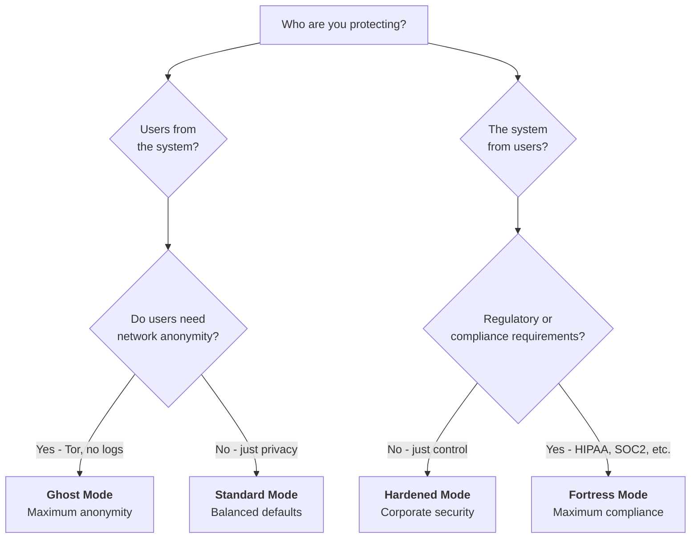

# Deployment Modes

SafeShare serves two fundamentally different missions depending on how you deploy it. Understanding this duality is the most important decision you'll make before configuring a single environment variable.

## The Duality

Every file-sharing platform sits somewhere on a spectrum between two opposing goals:

```
ANONYMITY                                                              SECURITY
Protect users from the system                    Protect the operator from users
"I can't hand over what I don't have"         "I need to control what flows through"

  [GHOST]           [STANDARD]           [HARDENED]           [FORTRESS]
```

**Anonymity mode** shields users. The operator minimizes what they know, what they log, and what they can be compelled to produce. Use cases: whistleblowing, journalism, activism, human rights.

**Security mode** shields the operator. The operator maximizes visibility, accountability, and control over what flows through their system. Use cases: corporate file transfer, regulated industries, compliance.

Both are legitimate. Both serve real needs. SafeShare is designed to serve either end — and anywhere in between — through configuration alone.

## Choosing Your Mode


```mermaid
flowchart TD
    A[Who are you protecting?] --> B{Users from<br/>the system?}
    A --> C{The system<br/>from users?}

    B --> D{Do users need<br/>network anonymity?}
    D -->|Yes - Tor, no logs| E["<b>Ghost Mode</b><br/>Maximum anonymity"]
    D -->|No - just privacy| F["<b>Standard Mode</b><br/>Balanced defaults"]

    C --> G{Regulatory or<br/>compliance requirements?}
    G -->|No - just control| H["<b>Hardened Mode</b><br/>Corporate security"]
    G -->|Yes - HIPAA, SOC2, etc.| I["<b>Fortress Mode</b><br/>Maximum compliance"]
```

### Quick Comparison

| Dimension | Ghost | Standard | Hardened | Fortress |
|-----------|-------|----------|----------|----------|
| **Trust model** | Operator trusts no one (including themselves) | Moderate trust | Operator controls access | Zero trust, full audit |
| **User authentication** | None | Optional | Required | Required; MFA and SSO available (MFA enrollment not yet enforced) |
| **IP logging** | Never received (Tor); not stored or logged | Logged | Logged | Logged + tamper-evident |
| **File content visibility** | None: browser encryption required | Server-side encrypted | Server-side encrypted | Server-side encrypted |
| **Metadata stripping** | In browser before upload (JPEG, PNG) | Off by default | Off by default | Off by default |
| **Network access** | Tor only | Clearnet | Clearnet + proxy | Clearnet + proxy |
| **Abuse prevention** | Minimal | Basic rate limits | Full controls | Full controls + audit |
| **Audit trail** | None (by design: the audit log is off in anonymous mode) | Tamper-evident audit log (on by default) + application logs | Tamper-evident audit log + structured JSON logs | Tamper-evident audit log + structured JSON logs + scheduled backups |
| **Database** | SQLite | SQLite | SQLite (PostgreSQL planned, not yet supported) | SQLite (PostgreSQL planned, not yet supported) |
| **Best for** | Whistleblowers, journalists | Personal use, small teams | Enterprises, internal tools | Regulated industries |

---

## Ghost Mode

**Maximum Anonymity**: the operator can't identify users, can't read what they upload, and keeps as little as possible that could be handed over if compelled.

### Who it's for

Whistleblower drops, journalist source protection, human rights organizations, activist networks, and any scenario where the operator's inability to cooperate with surveillance is a feature.

### Trust model

The operator deliberately limits what they can see and keep:
- **Cannot see who uploaded or downloaded a file.** Visitors arrive over Tor, so the server never receives their IP address. With `ANONYMOUS_MODE=true` the server also doesn't store or log IP addresses or user agents. Filenames are kept out of logs, and claim codes are removed from request paths in logs.
- **Cannot read file contents.** `REQUIRE_CLIENT_ENCRYPTION` defaults to on in anonymous mode. Every upload must be encrypted in the visitor's browser, and the key travels only in the share link's `#` fragment, which never reaches the server. The server refuses uploads that aren't marked as browser-encrypted. The `ENCRYPTION_KEY` the operator holds only adds a second layer around ciphertext it can't open.
- **Strips identifying metadata before upload.** With `STRIP_METADATA=true`, the browser removes EXIF/GPS/XMP data from JPEGs and text, EXIF and timestamp chunks from PNGs before encrypting them. The server can't strip ciphertext, so other formats (PDF, Office, video, audio) are uploaded as is, with a warning. See [What Ghost mode doesn't do](#what-ghost-mode-doesnt-do).
- **Keeps little that could be handed over.** No hash of uploaded content is stored, so a compelled operator can't confirm that a known document passed through. Deleted rows are overwritten in the database (`secure_delete`), and the write-ahead log is truncated after each cleanup. The audit log is off. Webhooks and SSO can't be turned on, and `/metrics` isn't served.
- **Reachable only as a Tor onion service.** The app has no published port and sits on an internal network that only the Tor container can reach.

### Configuration

```yaml
# docker-compose.ghost.yml
services:
  safeshare:
    image: fjmerc/safeshare:latest
    environment:
      # --- Anonymity ---
      - ANONYMOUS_MODE=true            # also turns on REQUIRE_CLIENT_ENCRYPTION
      - STRIP_METADATA=true
      - REQUIRE_AUTH_FOR_UPLOAD=false
      # --- Encryption at rest (second layer around browser-encrypted files) ---
      - ENCRYPTION_KEY=${ENCRYPTION_KEY}
      # --- Network ---
      - TRUST_PROXY_HEADERS=false
      - PUBLIC_URL=http://${ONION_ADDRESS}
      - READ_TIMEOUT=300
      - WRITE_TIMEOUT=300
      # --- Limits: behind Tor every visitor shares one address, so each
      #     per-IP limit below is a ceiling for the whole service ---
      - RATE_LIMIT_UPLOAD=100          # uploads/hour for everyone (chunks: 10x this)
      - RATE_LIMIT_DOWNLOAD=500        # downloads/hour for everyone
      - MAX_ENCRYPTED_DOWNLOADS_PER_IP=0
      - MAX_INFLIGHT_PER_IP_PER_FILE=0
      - QUOTA_LIMIT_GB=50
      # --- Short-lived files ---
      - DEFAULT_EXPIRATION_HOURS=1
      - MAX_EXPIRATION_HOURS=24
      - CLEANUP_INTERVAL_MINUTES=15
      # --- Admin (still needed for management) ---
      - ADMIN_USERNAME=${ADMIN_USERNAME}
      - ADMIN_PASSWORD=${ADMIN_PASSWORD}
    volumes:
      - safeshare-data:/app/data
      - safeshare-uploads:/app/uploads
    # No published ports, and no route to the internet
    networks:
      - onion-internal
    logging:
      driver: "none"

  tor:
    image: goldy/tor-hidden-service
    environment:
      SERVICE1_TOR_SERVICE_HOSTS: "80:safeshare:8080"
      SERVICE1_TOR_SERVICE_VERSION: "3"
    volumes:
      - tor-keys:/var/lib/tor/hidden_service
    networks:
      - onion-internal   # reaches SafeShare
      - tor-egress       # reaches the Tor network

volumes:
  safeshare-data:
  safeshare-uploads:
  tor-keys:

networks:
  onion-internal:
    internal: true
  tor-egress:
    driver: bridge
```

Until an admin saves a setting in the dashboard, these environment variables are authoritative. The first save stores every setting (quota, file size, expiration, rate limits, blocked extensions, feature flags), taking the values that are in effect at the time. From then on the stored settings take precedence over the environment on restart. Saving one setting no longer resets the others to built-in defaults.

### What Ghost mode doesn't do

These limits are inherent to the design. Plan around them rather than assuming they're covered:

- **Browser encryption is checked by flag, not proven.** The server can't tell ciphertext from plaintext. Requiring the flag protects honest uploaders from sending plaintext by mistake. It doesn't stop someone who deliberately uploads plaintext with the flag set.
- **Uploading needs Tor Browser or another browser with Web Crypto.** Tor Browser treats `.onion` pages as secure contexts, so encryption works over `http://`. Browsers that don't (for example Chromium behind a Tor proxy) are shown a message and can't upload. The SDKs and the import tool don't encrypt client-side, so they can't upload to a Ghost server.
- **Files are encrypted in browser memory.** Very large files (warned above 500 MB) can exhaust the tab's memory.
- **Metadata stripping covers JPEG and PNG only.** Other formats keep their metadata. Tell sources to scrub them first, for example with [mat2](https://0xacab.org/jvoisin/mat2). If a JPEG or PNG can't be parsed, the upload is stopped rather than sent unstripped. For uploads the server can strip (only when `REQUIRE_CLIENT_ENCRYPTION=false`), a failure, a file over 100 MB, or an encrypted PDF is rejected with `422 METADATA_STRIP_FAILED`.
- **The server still knows some things about each file.** It knows the ciphertext size, upload and expiry times to the second, download counts and the claim code. It also knows the filename unless **Hide filename** is checked, which is the default in Ghost mode. The admin dashboard shows these. They are deleted when the file expires.
- **Rate limits are shared by everyone.** Every Tor visitor arrives from the Tor container's address, so each per-IP limit is one budget for the whole service. That includes the login lockout. One heavy user can use it up for everyone until the hour rolls over. Size the limits above as service-wide ceilings.
- **Turning on anonymous mode doesn't erase earlier data.** IPs, user agents, hashes and audit entries recorded before `ANONYMOUS_MODE=true` was set stay in the database until those files expire or you delete them. Start Ghost deployments on a fresh database.
- **Some traces remain on the visitor's device.** The service worker caches the app's static assets (scripts, styles, icons), which shows the site was visited. Pages, uploads and downloads are never cached. In anonymous mode the browser keeps no recent-uploads list, no resume state and no filenames in notifications. In every mode, the E2E key is removed from the address bar and history once read. Tor Browser's own session clearing removes the rest.

### Trade-offs

- No abuse prevention: the operator cannot inspect or moderate content
- No user accountability: anonymous uploads mean no way to trace bad actors
- No content scanning: ciphertext can't be scanned (`MALWARE_SCAN_REJECT_UNSCANNABLE=true` conflicts with required browser encryption)
- Tor adds latency (200-500ms per hop) and limits throughput (1-5 MB/s)

### Deep dives

- [TOR_DEPLOYMENT.md](TOR_DEPLOYMENT.md): Complete Tor hidden service setup, verification, and threat model
- [E2E_ENCRYPTION.md](E2E_ENCRYPTION.md): Client-side encryption, required encryption, and in-browser metadata stripping

---

## Standard Mode

**Balanced Defaults** — secure file sharing with sensible defaults and minimal configuration.

### Who it's for

Personal file sharing, small teams, developers, anyone who wants a self-hosted alternative to WeTransfer or Firefox Send without complex setup.

### Trust model

The operator runs a straightforward service:
- Basic server-side encryption at rest (if `ENCRYPTION_KEY` is set)
- IPs are logged (for rate limiting and abuse response)
- Anonymous uploads allowed by default
- Files auto-expire (24 hours default)

### Configuration

```bash
# Standard mode — one command
docker run -d \
  -p 8080:8080 \
  -e ENCRYPTION_KEY="$(openssl rand -hex 32)" \
  -e ADMIN_USERNAME=admin \
  -e ADMIN_PASSWORD="$(openssl rand -base64 16)" \
  -v safeshare-data:/app/data \
  -v safeshare-uploads:/app/uploads \
  --name safeshare \
  fjmerc/safeshare:latest
```

This gives you:
- AES-256-GCM encryption at rest
- Admin dashboard at `/admin/login`
- Anonymous uploads with 24-hour expiration
- Rate limiting (10 uploads/hour, 50 downloads/hour per IP)
- File extension blocking (executables, scripts)
- Security headers and CSRF protection

### Recommended additions

| Addition | Why | How |
|----------|-----|-----|
| HTTPS via reverse proxy | Enables E2E encryption in browsers | See [REVERSE_PROXY.md](REVERSE_PROXY.md) |
| Storage quota | Prevents disk abuse | `-e QUOTA_LIMIT_GB=50` |
| Monitoring | Visibility into usage | See [PROMETHEUS.md](PROMETHEUS.md) |

### Deep dives

- [PRODUCTION.md](PRODUCTION.md) — Full production deployment runbook
- [REVERSE_PROXY.md](REVERSE_PROXY.md) — Traefik, nginx, Caddy, Apache configurations

---

## Hardened Mode

**Corporate Security** — the operator requires authentication, visibility, and control over all file sharing activity.

### Who it's for

Enterprises sharing files internally or with partners, teams handling sensitive (but not regulated) data, organizations that need audit trails and access control.

### Trust model

The operator enforces accountability:
- **All users must authenticate** before uploading
- **MFA available** for database user accounts (TOTP, WebAuthn); enrolled users are challenged at login. `MFA_REQUIRED` is not yet enforced (it only logs a warning for users who haven't enrolled), and the env-based `ADMIN_USERNAME` admin is never challenged for MFA
- **Webhooks** notify external systems of file events
- **IP blocking** stops known bad actors
- **Tamper-evident audit log** (on by default outside anonymous mode, `AUDIT_LOG=auto`): signed, chained entries for logins, admin actions, uploads and downloads, browsable in the admin dashboard's **Audit Log** tab
- **Structured JSON application logs** for SIEM integration

### Configuration

```yaml
# docker-compose.hardened.yml
services:
  safeshare:
    image: fjmerc/safeshare:latest
    environment:
      # --- Authentication ---
      - REQUIRE_AUTH_FOR_UPLOAD=true
      - ADMIN_USERNAME=${ADMIN_USERNAME}
      - ADMIN_PASSWORD=${ADMIN_PASSWORD}
      - SESSION_EXPIRY_HOURS=8
      # --- Encryption ---
      - ENCRYPTION_KEY=${ENCRYPTION_KEY}
      - HTTPS_ENABLED=true
      # --- MFA (users who enroll are challenged at login) ---
      - FEATURE_MFA=true
      - MFA_ENABLED=true
      # --- Integrations ---
      - FEATURE_WEBHOOKS=true
      - FEATURE_API_TOKENS=true
      # --- Malware scanning (see ADR-015; scanning is synchronous — set
      #     CLAMAV_MAX_FILE_SIZE no higher than clamd's own StreamMaxLength,
      #     or files under your limit but over clamd's will error the scan.
      #     CLAMAV_TIMEOUT is an idle timeout only; CLAMAV_SCAN_TIMEOUT bounds
      #     the wait for clamd's verdict and must stay above clamd.conf's own
      #     MaxScanTime. See docs/SECURITY.md for required clamd.conf hardening
      #     — AlertExceedsMax yes in particular, or oversize/limit-exceeded
      #     content scans as clean regardless of these settings.) ---
      - FEATURE_MALWARE_SCAN=true
      - CLAMAV_HOST=clamav
      - CLAMAV_PORT=3310
      - CLAMAV_TIMEOUT=30
      - CLAMAV_SCAN_TIMEOUT=180
      - CLAMAV_MAX_FILE_SIZE=104857600
      - MALWARE_SCAN_ALLOW_UNVERIFIED=false  # see docs/SECURITY.md: uploader-triggerable, effectively an opt-out of scanning under attack
      - MALWARE_SCAN_REJECT_UNSCANNABLE=false
      # --- Audit log (default AUDIT_LOG=auto is already on here). The signing key
      #     is generated into /app/data/audit.key; back it up with the database,
      #     or set AUDIT_LOG_KEY to a 64-hex-character secret instead. ---
      # - AUDIT_LOG_KEY=${AUDIT_LOG_KEY}
      # --- Access control ---
      - BLOCKED_EXTENSIONS=.exe,.bat,.cmd,.sh,.ps1,.dll,.so,.msi,.scr,.vbs,.jar,.com,.app,.deb,.rpm
      - RATE_LIMIT_UPLOAD=10
      - RATE_LIMIT_DOWNLOAD=50
      - QUOTA_LIMIT_GB=100
      - MAX_FILE_SIZE=5368709120
      # --- Proxy ---
      - TRUST_PROXY_HEADERS=auto
      - PUBLIC_URL=https://share.yourcompany.com
    volumes:
      - safeshare-data:/app/data
      - safeshare-uploads:/app/uploads
    ports:
      - "8080:8080"
    depends_on:
      clamav:
        condition: service_started

  clamav:
    image: clamav/clamav:latest
    volumes:
      - clam-db:/var/lib/clamav
    restart: unless-stopped

volumes:
  safeshare-data:
  safeshare-uploads:
  clam-db:
```

### What this enables

- **User management**: Invite-only registration, role-based access (user/admin)
- **MFA**: TOTP authenticator apps and WebAuthn for database user accounts; enrolled users are challenged at login (`MFA_REQUIRED` is not yet enforced)
- **Malware scanning**: Uploaded files scanned synchronously via ClamAV sidecar before storage — an infected file is rejected outright and never gets a download link (see ADR-015)
- **Webhook notifications**: Real-time alerts on `file.uploaded`, `file.downloaded`, `file.expired`, `file.deleted`, `file.infected`
- **API tokens**: Programmatic access with scoped permissions and rotation
- **Audit log**: Logins, uploads, downloads, deletions and admin actions are recorded in a tamper-evident, HMAC-signed chain in the database (v1.11.0+), with filtering, CSV/JSON Lines export and integrity verification in the admin dashboard's **Audit Log** tab. See [SECURITY.md](SECURITY.md) for what is and isn't recorded

### Trade-offs

- Users must create accounts and authenticate — higher friction
- Anonymous sharing is no longer possible
- Requires ongoing user administration (invites, password resets, etc.)

### Deep dives

- [SECURITY.md](SECURITY.md) — Full security feature documentation and compliance mapping
- [MFA_SETUP.md](MFA_SETUP.md) — MFA configuration with authenticator apps and WebAuthn
- [SSO_SETUP.md](SSO_SETUP.md) — Enterprise SSO with OIDC providers

---

## Fortress Mode

**Maximum Compliance** — every action is logged, verified, and auditable. Built for regulated environments.

### Who it's for

Financial services, healthcare (HIPAA), government agencies, defense contractors, and any organization where regulatory compliance is non-negotiable.

### Trust model

Zero trust with full audit:
- **Authentication paths hardened** (MFA available and enforced at login for enrolled users, SSO available, short sessions). `MFA_REQUIRED` is not yet enforced, so enrollment cannot yet be made mandatory
- **Database**: SQLite today. PostgreSQL support is planned but **not yet supported**; the server refuses to start with `DATABASE_TYPE=postgresql`
- **Automated backups** with retention policies
- **Auditable actions** through the tamper-evident audit log (signed, chained entries in the database, on by default) plus structured application logs

### Configuration

```yaml
# docker-compose.fortress.yml
services:
  safeshare:
    image: fjmerc/safeshare:latest
    environment:
      # --- Authentication ---
      - REQUIRE_AUTH_FOR_UPLOAD=true
      - ADMIN_USERNAME=${ADMIN_USERNAME}
      - ADMIN_PASSWORD=${ADMIN_PASSWORD}
      - SESSION_EXPIRY_HOURS=4
      # --- Encryption ---
      - ENCRYPTION_KEY=${ENCRYPTION_KEY}
      - HTTPS_ENABLED=true
      # --- MFA (available; enrolled users are challenged at login) ---
      # MFA_REQUIRED=true is accepted but not yet enforced: it only logs a
      # warning for users who haven't enrolled, and the env-based
      # ADMIN_USERNAME admin is never challenged for MFA.
      - FEATURE_MFA=true
      - MFA_ENABLED=true
      - MFA_REQUIRED=true
      # --- SSO ---
      - FEATURE_SSO=true
      - ENABLE_SSO=true
      - SSO_AUTO_PROVISION=true
      - SSO_DEFAULT_ROLE=user
      - SSO_SESSION_LIFETIME=480
      # --- Integrations ---
      - FEATURE_WEBHOOKS=true
      - FEATURE_API_TOKENS=true
      # --- Malware scanning (see ADR-015; scanning is synchronous — set
      #     CLAMAV_MAX_FILE_SIZE no higher than clamd's own StreamMaxLength,
      #     or files under your limit but over clamd's will error the scan.
      #     CLAMAV_TIMEOUT is an idle timeout only; CLAMAV_SCAN_TIMEOUT bounds
      #     the wait for clamd's verdict and must stay above clamd.conf's own
      #     MaxScanTime. See docs/SECURITY.md for required clamd.conf hardening
      #     — AlertExceedsMax yes in particular, or oversize/limit-exceeded
      #     content scans as clean regardless of these settings.) ---
      - FEATURE_MALWARE_SCAN=true
      - CLAMAV_HOST=clamav
      - CLAMAV_PORT=3310
      - CLAMAV_TIMEOUT=30
      - CLAMAV_SCAN_TIMEOUT=180
      - CLAMAV_MAX_FILE_SIZE=104857600
      - MALWARE_SCAN_ALLOW_UNVERIFIED=false  # see docs/SECURITY.md: uploader-triggerable, effectively an opt-out of scanning under attack
      - MALWARE_SCAN_REJECT_UNSCANNABLE=false
      # --- Audit log (default AUDIT_LOG=auto is already on here). The signing key
      #     is generated into /app/data/audit.key; back it up with the database,
      #     or set AUDIT_LOG_KEY to a 64-hex-character secret instead. ---
      # - AUDIT_LOG_KEY=${AUDIT_LOG_KEY}
      # --- PostgreSQL (not yet supported) ---
      # The server does not use PostgreSQL yet and refuses to start with
      # DATABASE_TYPE=postgresql; keep SQLite until PostgreSQL support ships.
      # - DATABASE_TYPE=postgresql
      # - FEATURE_POSTGRESQL=true
      # - PG_HOST=postgres
      # - PG_PORT=5432
      # - PG_USER=${PG_USER}
      # - PG_PASSWORD=${PG_PASSWORD}
      # - PG_DATABASE=safeshare
      # - PG_SSL_MODE=require
      # - PG_MAX_CONNECTIONS=25
      # --- Access control ---
      - BLOCKED_EXTENSIONS=.exe,.bat,.cmd,.sh,.ps1,.dll,.so,.msi,.scr,.vbs,.jar,.com,.app,.deb,.rpm
      - RATE_LIMIT_UPLOAD=5
      - RATE_LIMIT_DOWNLOAD=20
      - QUOTA_LIMIT_GB=500
      - MAX_FILE_SIZE=10737418240
      # --- Backups ---
      - FEATURE_BACKUPS=true
      - AUTO_BACKUP_ENABLED=true
      - AUTO_BACKUP_SCHEDULE=0 2 * * *
      - AUTO_BACKUP_MODE=full
      # Retention (v1.11.1+) deletes EVERY backup-* folder in BACKUP_DIR older
      # than 90 days after each scheduled run, including manual/CLI backups.
      - AUTO_BACKUP_RETENTION_DAYS=90
      # --- Proxy ---
      - TRUST_PROXY_HEADERS=auto
      - PUBLIC_URL=https://share.yourcompany.com
    volumes:
      - safeshare-data:/app/data
      - safeshare-uploads:/app/uploads
    ports:
      - "8080:8080"
    depends_on:
      clamav:
        condition: service_started

  clamav:
    image: clamav/clamav:latest
    volumes:
      - clam-db:/var/lib/clamav
    restart: unless-stopped

volumes:
  safeshare-data:
  safeshare-uploads:
  clam-db:
```

### Infrastructure requirements

Fortress mode requires infrastructure beyond a single Docker container:

| Component | Purpose | Required? |
|-----------|---------|-----------|
| PostgreSQL 16+ | Durable database with replication support | Not yet supported (planned) |
| ClamAV | Malware scanning sidecar (~1GB RAM for signature DB) | Yes |
| Reverse proxy (Traefik/nginx) | TLS termination, security headers | Yes |
| Log aggregation (ELK/Splunk/Datadog) | Centralized audit log storage | Recommended |
| Prometheus + Grafana | Monitoring and alerting | Recommended |
| Backup storage | Off-site encrypted backup destination | Yes |

### Compliance mapping

SafeShare features map to common compliance frameworks:

| Requirement | SafeShare Feature |
|-------------|-------------------|
| **Access control** (HIPAA, SOC2, GDPR) | Auth required + MFA (enrolled users challenged; not yet enforceable) + SSO + role-based access |
| **Encryption at rest** (HIPAA, PCI-DSS) | AES-256-GCM with `ENCRYPTION_KEY` |
| **Encryption in transit** (all) | HTTPS via reverse proxy |
| **Audit logging** (SOC2, HIPAA) | Tamper-evident audit log (HMAC-signed chain, Audit Log tab, CSV/JSON Lines export, integrity verification, configurable retention) plus structured JSON logs. Ship application logs off-box so the periodic checkpoint lines can detect deleted newest entries |
| **Data retention** (GDPR) | Configurable expiration, automated cleanup |
| **Backup and recovery** (SOC2) | Automated backups with retention policies (retention also deletes manual backups in `BACKUP_DIR`; back up `audit.key` with the database) |
| **User authentication** (all) | Username/password + MFA (enrolled users) + SSO |

### Trade-offs

- Highest operational complexity — requires monitoring and backup infrastructure (PostgreSQL will be added when supported)
- More friction for end users — MFA enrollment, SSO integration, no anonymous access
- Higher resource requirements — ClamAV, log storage, backup storage

### Deep dives

- [HA_DEPLOYMENT.md](HA_DEPLOYMENT.md) — Planned high-availability design with PostgreSQL and S3 (**not yet supported**)
- [PROMETHEUS.md](PROMETHEUS.md) — Monitoring, metrics, and alerting configuration
- [BACKUP_RESTORE.md](BACKUP_RESTORE.md) — Backup procedures and disaster recovery
- [SECURITY.md](SECURITY.md) — Compliance mapping details (HIPAA, SOC2, GDPR, PCI-DSS)

---

## Feature Matrix

Comprehensive mapping of every major feature to its recommended deployment mode.

| Feature | Ghost | Standard | Hardened | Fortress |
|---------|:-----:|:--------:|:--------:|:--------:|
| **Anonymous uploads** | On | On | Off | Off |
| **Anonymous mode (IP redaction)** | On | Off | Off | Off |
| **Metadata stripping** | On (in browser: JPEG, PNG) | Off | Off | Off |
| **Tor hidden service** | Yes | No | No | No |
| **E2E encryption (client-side)** | Required (`REQUIRE_CLIENT_ENCRYPTION`) | Available | Available | Available |
| **Encryption at rest (server-side)** | On | On | On | On |
| **Password-protected files** | Available | Available | Available | Available |
| **User authentication** | Off | Optional | Required | Required |
| **MFA (TOTP/WebAuthn)** | Off | Off | Available | Available (`MFA_REQUIRED` not yet enforced) |
| **SSO (OIDC)** | Blocked in anonymous mode | Off | Optional | On |
| **Admin dashboard** | On | On | On | On |
| **IP blocking** | Off | Available | On | On |
| **Rate limiting** | On (service-wide behind Tor) | On | On | Strict |
| **Malware scanning (ClamAV)** | Off | Off | On | On |
| **Extension blocking** | On | On | On | On |
| **Webhooks** | Blocked in anonymous mode | Off | On | On |
| **API tokens** | Off | Off | On | On |
| **PostgreSQL backend** | No | No | Planned (not yet supported) | Planned (not yet supported) |
| **Automated backups** | No | No | Optional | Yes |
| **Prometheus metrics** | Not served (`METRICS_IN_ANONYMOUS_MODE` to override) | Optional | Recommended | Yes |
| **Structured audit logs** | Disabled (off in anonymous mode unless `AUDIT_LOG=true`; entries recorded before switching an existing server to anonymous mode are kept) | Tamper-evident audit log (default `AUDIT_LOG=auto`) | Tamper-evident audit log + structured logs | Tamper-evident audit log + structured logs |
| **Storage quotas** | Optional | Optional | On | On |
| **File expiration (max)** | 24h | 7 days | 7 days | Configurable |

---

## Mixing Modes

These profiles are guidelines, not hard rules. You can mix settings to fit your needs. However, some combinations are **contradictory** — enabling both sides simultaneously creates a configuration that undermines itself.

### Contradictory combinations

| Setting A | Setting B | Why they conflict |
|-----------|-----------|-------------------|
| `ANONYMOUS_MODE=true` | IP blocking via admin dashboard | You can't ban IPs you don't record |
| E2E encryption (client-side) | Content scanning / inspection | You can't scan what you can't read |
| `REQUIRE_AUTH_FOR_UPLOAD=true` | `ANONYMOUS_MODE=true` | Auth creates identity; anonymous mode erases it |
| Tor-only deployment | Webhooks to external services | Webhooks leak the server's network identity (SafeShare refuses to enable webhooks or SSO in anonymous mode) |
| `REQUIRE_CLIENT_ENCRYPTION=true` | `MALWARE_SCAN_REJECT_UNSCANNABLE=true` | Every browser-encrypted upload is unscannable, so every upload would be rejected (logged as an error at startup) |

### Common hybrids

**"Privacy-Conscious Team"** — Standard mode + metadata stripping:
```bash
-e STRIP_METADATA=true
-e ENCRYPTION_KEY="..."
-e REQUIRE_AUTH_FOR_UPLOAD=true
```
Users authenticate, but uploaded file metadata is scrubbed.

**"Hardened with E2E Option"** — Hardened mode + client-side encryption available:
```bash
# No extra config needed — E2E is always available over HTTPS
# Users choose per-file whether to enable client-side encryption
```
Corporate control with an option for users to add E2E for sensitive files.

**"Ghost with Admin Oversight"** — Ghost mode + admin dashboard for storage management:
```bash
-e ANONYMOUS_MODE=true
-e STRIP_METADATA=true
-e ADMIN_USERNAME=admin
-e ADMIN_PASSWORD="..."
```
The admin can manage storage and delete files but cannot see who uploaded them or open their contents. Uploads still have to be encrypted in the browser, because anonymous mode turns on `REQUIRE_CLIENT_ENCRYPTION`. The first dashboard save stores all settings with the values in effect at that moment, and those then override the environment on later restarts. Saving one setting doesn't reset the others, so Ghost's short expirations survive the admin's first visit.

---

## Next Steps

1. **Choose your mode** using the decision flowchart above
2. **Copy the configuration** from the relevant section
3. **Follow the deployment guide** for your chosen mode:
   - Ghost: [TOR_DEPLOYMENT.md](TOR_DEPLOYMENT.md)
   - Standard/Hardened: [PRODUCTION.md](PRODUCTION.md)
   - Fortress: [PRODUCTION.md](PRODUCTION.md) (multi-instance HA with PostgreSQL/S3 in [HA_DEPLOYMENT.md](HA_DEPLOYMENT.md) is planned, not yet supported)
4. **Review the security checklist** in [SECURITY.md](SECURITY.md)
